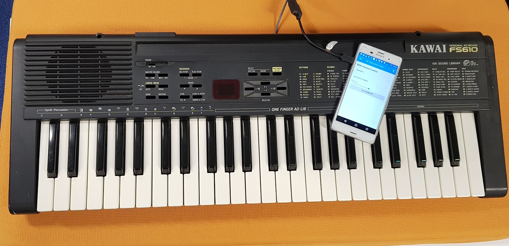
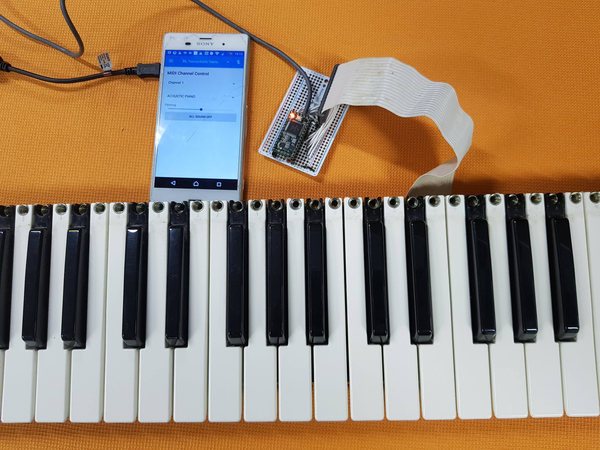

# MIDI Keyboard

Project to MIDI-fy a broken piano keyboard.

Figure: The final keyboard, showing USB connection to phone running MIDI synth app.

## Overview

* Pulled the keyboard out, which was connected to main electronics via a ribbon cable (see photo below). 
* Determined that the ribbon cable is connected to the physical keys via a [scan matrix](http://www.openmusiclabs.com/learning/digital/input-matrix-scanning/index.html) configuration. 
* Soldered the ribbon cable wires to digital I/O pins of a [Teensy 3.2](https://www.pjrc.com/store/teensy32.html).
* Wrote an [arduino sketch](midi_keyboard/midi_keyboard.ino) to drive/sample the scan matrix, and produce MIDI events over USB based on key presses.
* Plugged the arduino into an android phone via USB OTG, and ran [Fluid Synth MIDI android app](https://play.google.com/store/apps/details?id=net.volcanomobile.fluidsynthmidi&hl=en) to generate note sounds from USB MIDI.

 

Figure: The bare keyboard showing ribbon-cable connected to Teensy board

## Notes:
* When programming Teensy, make sure to select USB Type - MIDI in tools menu.
* It's quite nice how the full system is powered by the phone via the USB OTG cable. This seems like a pretty handy way to create new MIDI instruments.